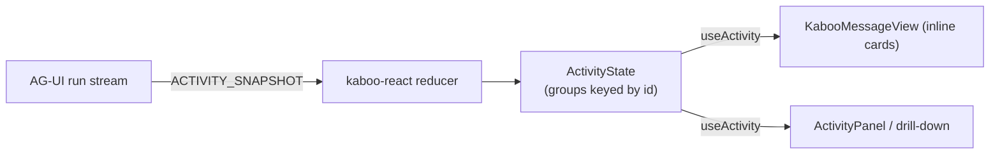

# Concepts — the data model

How kaboo-react turns an AG-UI stream into the hierarchical activity you see.

## One stream, two views

Activity rides the **same AG-UI run stream** as the chat — there is no second
endpoint. kaboo-workflows emits `ACTIVITY_SNAPSHOT` events interleaved with the
normal `TEXT_MESSAGE_*` / `TOOL_CALL_*` events. kaboo-react consumes those
snapshots and materializes them into a tree of `StreamGroup`s that the chat and
the activity panel both read from.



## `StreamGroup` — one node of the tree

Each agent run is a `StreamGroup`. The tree is formed by `parentGroup` (a group
id or `null` for a root). The fields you'll touch most:

| Field | Meaning |
|-------|---------|
| `title` / `agentName` | Display title and machine name of the run. |
| `parentGroup` | Parent group id, or `null` for a top-level group. |
| `status` | `active` \| `completed` \| `error` \| `interrupted`. |
| `task` | What this agent was asked to do (shown atop its card). |
| `timeline` | Interleaved text/tool entries in order. |
| `tools` | Every tool call in the group, in call order. |
| `tokens` | Accumulated streamed text. |
| `structuredOutput` / `outputSchemaName` | Schema-shaped output + which renderer to use. |
| `interrupt` | The open HITL interrupt when the group is paused. |
| `turnId` | Stable per user turn (survives interrupt/resume) — prefer it over `runId` for turn scoping. |

Inline flags (`inlineChatOwner`, `isChatReply`) let the chat avoid drawing a
card's text twice when the agent's reply already appears in the chat bubble.

## Reading the tree

`useActivity()` returns the groups; helpers navigate them:

```tsx
import { useActivity, topLevelGroups, directChildren } from "kaboo-react";

export function RootCount() {
  const { groups } = useActivity();
  const roots = topLevelGroups(groups);
  return <span>{roots.length} root agents</span>;
}
```

See [Activity panel & drill-down](activity-panel.md) for the components that
render this tree, and [Human-in-the-loop](hitl.md) for how `interrupt` surfaces.

## Where it sits in the stack

kaboo-react is the UI layer of the
[kaboo stack](https://gl-pgege.github.io/kaboo-docs/):
[kaboo-workflows](https://gl-pgege.github.io/kaboo-workflows/) produces the
stream, [kaboo-runtime](https://gl-pgege.github.io/kaboo-runtime/) persists and
replays it, and kaboo-react renders it.
